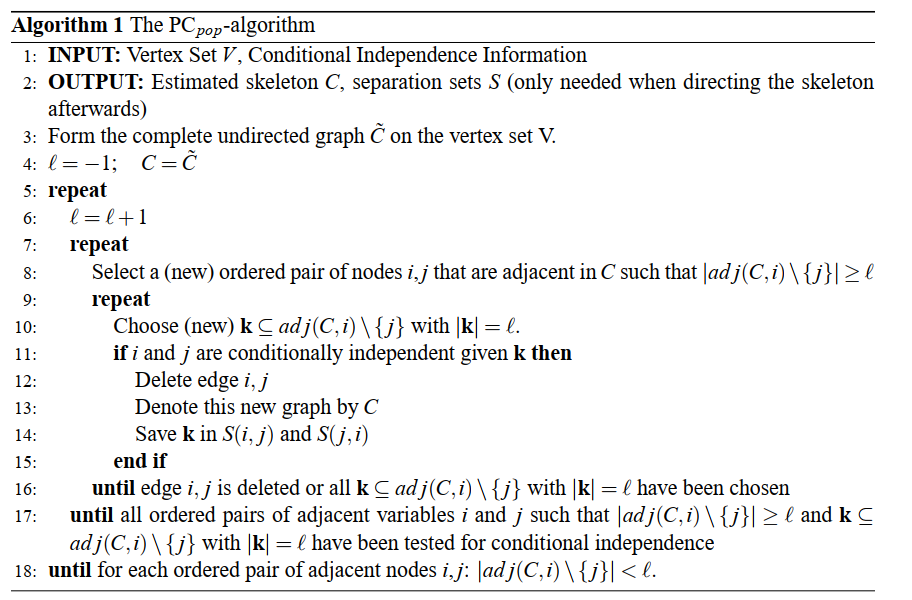
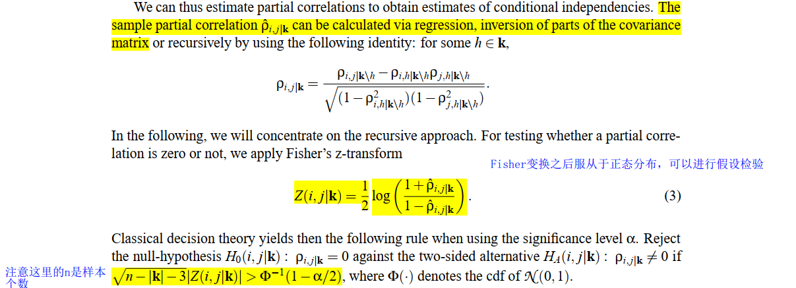
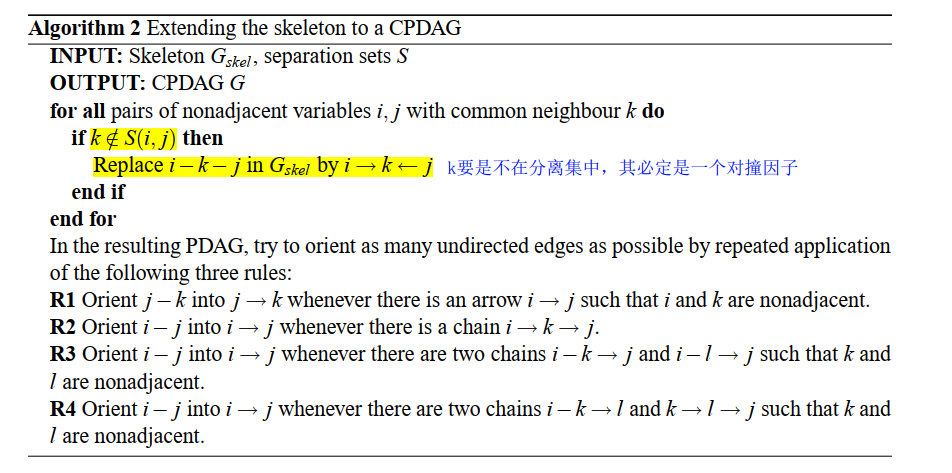
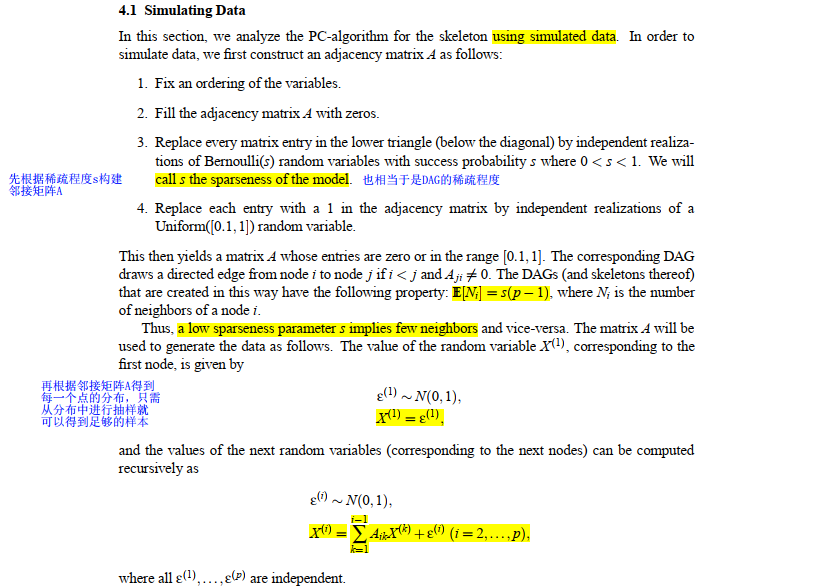

# PC算法的实现

## 1. PC算法简介

在因果推断中,因果图是非常重要的一个工具.有了因果图我们就可以很好地去进行因果效应分析.所以如何从数据中去构造因果图成为了一个很重要地问题.

- 因果图的特点:因果图是一个directed acyclic graph(DAG).有向是因果与关联的最大区别,因果说明两个有关系的变量一定一个是因,一个是果,两个变量的地位是不同的.
- 为何提出PC算法:完全可以使用独立性判断和一些因果规则来暴力求解因果图.但是当因果图中节点很多时,因果图的求解问题就变味了一个高维问题,是难以求解的.因此提出PC算法来解决高维稀疏因果图的求解.
- PC算法的主要流程:构造一个完全无向图-->根据条件独立性来删除边,构造DAG的skeleton-->应用因果图的一些规则来扩展到completed partially directed acyclic graph(CPDAG)

## 2. 定义

- 图:G=(V,E),V=(1,2,...,p).V为因果图的结点集,p为节点个数.
- 邻接集:adj(G,i)
- X(i):第i个节点的样本向量.[x1,x2,...,xn],n为样本个数

## 3. PC算法流程

### (1)构建skeleton

### (2)独立性检验(构建skeleton算法的第11行)

这里是对条件独立性的检验:i,j在分离集S的条件下是否独立

方法是先计算所有节点的相关性矩阵,然后计算i,j在S条件下的条件偏相关系数(partial correlation).得到偏相关系数后进行fisher变换,最后进行假设检验.(具体方法见代码)

### (3)应用因果图规则扩展至CPDAG

这里得到的CPDAG是所要求的DAG的等价类.

## 4. 算法评价

使用模拟数据对PC算法的性能进行检验,以Structural Hamming Distance 以及TPR,FPR作为评价指标

### (1)模拟数据方法

具体来说就是先模拟构造邻接矩阵,再通过邻接矩阵递归地构造数据.

### (2) 评价指标

Structural Hamming Distance:由估计的CPDAG到真实的DAG需要改变多少次边.换句话说,也就是两个邻接矩阵有多少个元素不同.

## 5. 代码

MyPC.py:包含了整个PC算法.

SimulateData.py:包含了模拟数据的算法,并保存在(./data/SimulateData.csv)中.

evaluation.py:实现了使用利用模拟数据对PC算法进行评价,评价指标为Structural Hamming Distance.

# 6. Reference

[1]Peter, K. M. a. B. (2012). "Estimating high-dimensional directed acyclic graphs with the PC-algorithm." Journal of Machine Learning Research（JMLR） 8(2): 613-636.